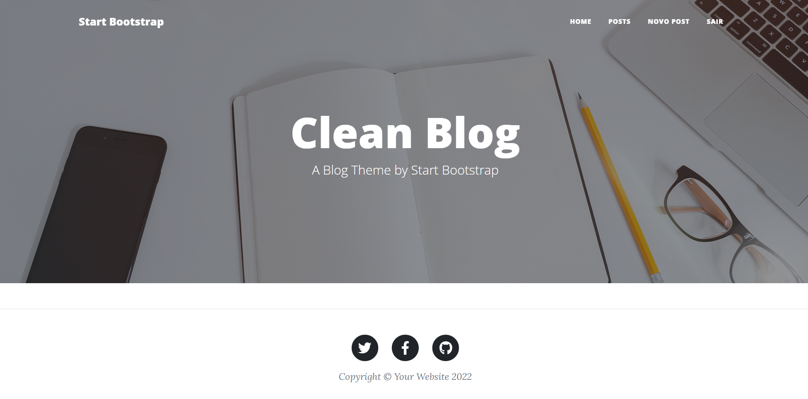

<h1 align="center"> Django Blog </h1>
<h2 align="center"> Desenvolvendo um blog utilizando Django 4 </h2>

    

> Status do Projeto: Em desenvolvimento :warning:

## Sobre o desenvolvimento do projeto
A ideia principal com o desenvolvimento desse projeto é revisar os conceitos do django framework e entender na prática as principais diferenças da versão 3.x para a 4.x. 

## Funcionalidades (Completas ou em desenvolvimento)

:heavy_check_mark: Fazer um novo post

:heavy_check_mark: Lista de todos os posts públicos 

:heavy_check_mark: Excluir post

:heavy_check_mark: Post público ou privado

:heavy_check_mark: Visualização apenas de posts públicos

:heavy_check_mark: Cadastro de novos usuários

:exclamation: Usuários só tem controle de seus próprios posts (atualização e exclusão)

:exclamation: Usuários não autenticados têm navegação limitada.
 

    
    Exemplo da lista de posts.

## Template
O template utilizado foi desenvolvido por **Start Bootstrap** e está disponível em: https://github.com/StartBootstrap/startbootstrap-clean-blog